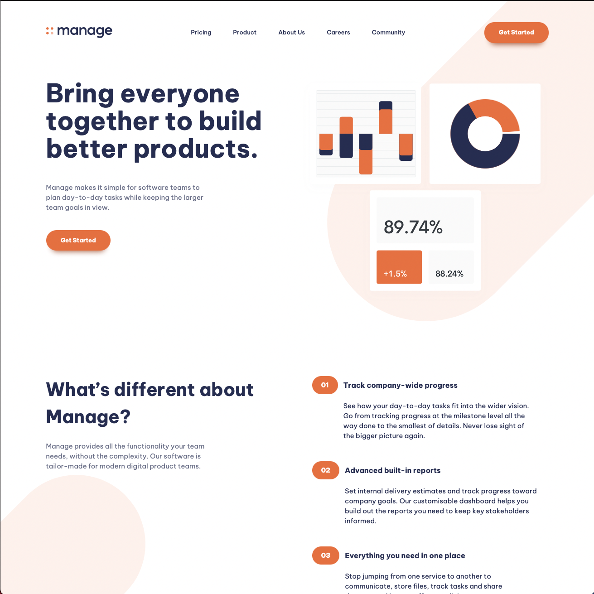

# Frontend Mentor - Manage landing page solution

This is a solution to the [Manage landing page challenge on Frontend Mentor](https://www.frontendmentor.io/challenges/manage-landing-page-SLXqC6P5). Frontend Mentor challenges help you improve your coding skills by building realistic projects.

## Table of contents

- [Overview](#overview)
  - [The challenge](#the-challenge)
  - [Screenshot](#screenshot)
  - [Links](#links)
- [My process](#my-process)
  - [Built with](#built-with)
  - [What I learned](#what-i-learned)
  - [Continued development](#continued-development)
  - [Useful resources](#useful-resources)

**Note: Delete this note and update the table of contents based on what sections you keep.**

## Overview

Found this project on Kevin Powell's Youtube channel and thought it would be a great page to learn from as I have not built a full page like this with background elements.

### The challenge

Users should be able to:

- View the optimal layout for the site depending on their device's screen size
- See hover states for all interactive elements on the page
- See all testimonials in a horizontal slider
- Receive an error message when the newsletter sign up `form` is submitted if:
  - The `input` field is empty
  - The email address is not formatted correctly

### Screenshot

### Links

- Solution URL: [Add solution URL here](https://edbizichjr.github.io/FEM-manage-landing-page-master/)

## My process

For this I followed along a tutorial to understand how to set up the basic webpage. I learned to start with utility classes and how to get things in place so it helps layout a page and duplicate it later on.

### Built with

- Semantic HTML5 markup
- CSS custom properties
- Flexbox
- CSS Grid
- Mobile-first workflow

### What I learned

The importance of utility classes and working with pseudo styles.

### Continued development

### Useful resources

- [Example resource 1](https://www.youtube.com/watch?v=h3bTwCqX4ns&list=PL4-IK0AVhVjNDRHoXGort7sDWcna8cGPA) - This is the playlist I followed along and have learned alot to use in the future.
